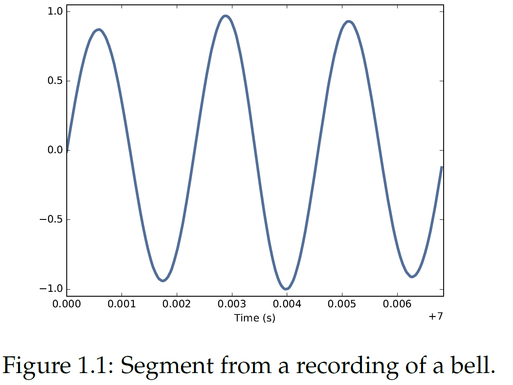
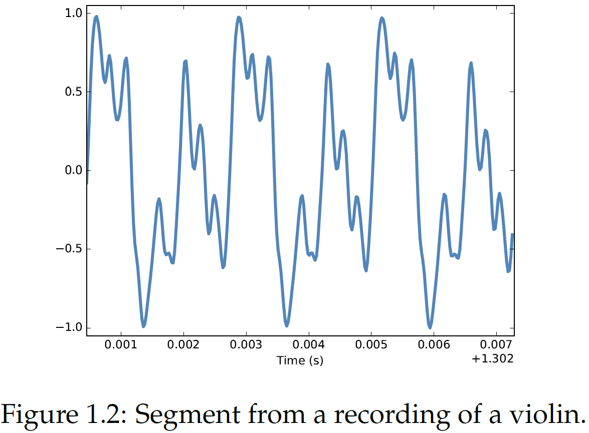
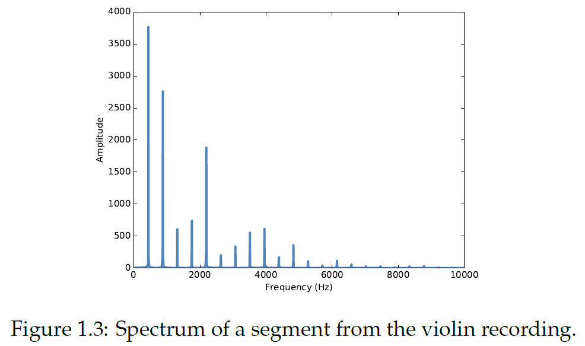
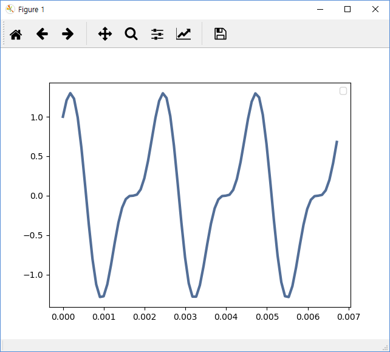
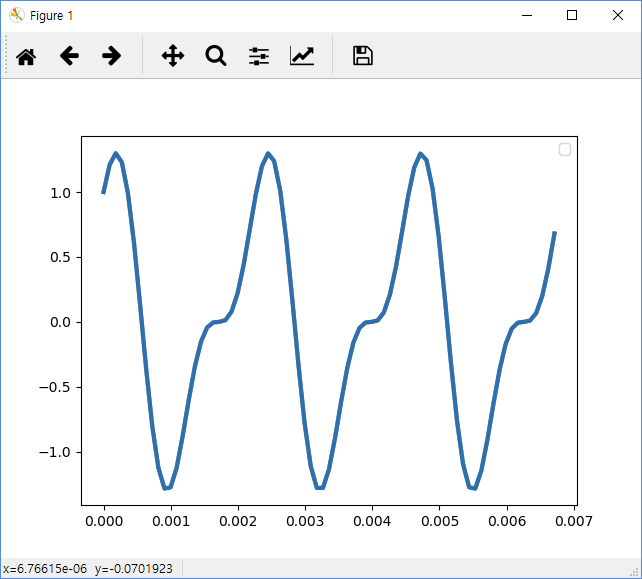
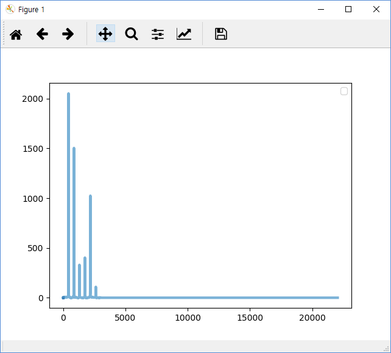

Think DSP
===


### Chapter #1 : Sound and Signls

###### Heecheol  Yang

---

# Contents

- Periodic Signals
- Spedctral decomposition
- Signals
- Excercises
- Questions
---

# Periodic Signals

## Signal (신호)
시간에 따라 달라지는 양 (Quantity)
- 예) Sound Signal : **시간** 에 따라 달라지는 **공기압**


## Periodic Signal
특정 주기마다 반복되어 나타나는 신호.
- Cycle : 신호 내에서 반복되는 모양
- Period : 한 Cycle의 길이(시간)
- Frequency : 초당 발생하는 Cycle의 개수 (단위 : Hz)
> Frequency = 1/(Period)


---

## Exmaple


- 3개의 Cycle
- Period : 2.3ms
- Frequency : (1/2.3ms) = 434.78 Hz

---

# Spectral Decomposition

- Idea : 어떤 신호라도 서로 다른 주파수의 사인파의 합으로 표현할 수 있다.

## Discrete Fourier Transform (DFT)
- 신호를 Spectrum으로 변환
- Spectrum : 신호를 구성하는 사인파들의 집합
- Fast Fourier Transform (FFT) : DFT를 빨리 수행하기 위한 알고리즘


---

## Signal and Spectrum
|항목| 원본신호|스펙트럼|
|:-:|:-:|:-:|
|그래프|||
|Y축|시간|주파수|
|Y축|신호 크기|주파수 크기 (Amplitude)|


---

## Spectrum Example


- Fundamental Frequency : 가장 낮은 값의 주파수 (440Hz)
- Dominant Frequency :가장 크기가 큰 주파수 (440Hz)
> 이 예제에서는 Fundamental / Dominant Frequency가 같다.


---
## Spectrum Example


### Harmonics
- Fundamental Frequency의 정수배의 주파수들
- 440, 880, 1320, 1760 Hz
---

# Excercises

## 공통 코드
이 코드를 맨 위에 넣은 후 이후 코드들을 추가
```python
from __future__ import print_function, division

# We don't need this link. Comment Out
# %matplotlib inline

import thinkdsp
import thinkplot

import numpy as np

from ipywidgets import interact, interactive, fixed
import ipywidgets as widgets
from IPython.display import display

```

---

## Excercise 1 : Signal Plotting

```python
# Generate COS and SINE signals
cos_sig = thinkdsp.CosSignal(freq=440, amp=1.0, offset=0)
sin_sig = thinkdsp.SinSignal(freq=880, amp=0.5, offset=0)

# Mix them
mix = sin_sig + cos_sig

# Plot
mix.plot()
thinkplot.show()
```

---
## Excercise 1 : Signal Plotting (Cont'd)



---

## Excercise 2 : Wave
Wave : 연속적인값을 갖는 Signal을 Sampling하여 얻은 값의 집합

```python
# Convert signal into Wave
wave = mix.make_wave(duration=0.5, start=0, framerate=11025)
period = mix.period
segment = wave.segment(start=0, duration=period*3)
segment.plot()
thinkplot.show()
```

---
## Excercise 2 : Wave (Cont'd)


---
## Excercise 3 : Spectrum
```python
# Excercise 3 : Spectrum

# Read wave from wav file
wave = thinkdsp.read_wave('92002__jcveliz__violin-origional.wav')
start = 1.2
duration = 0.6
segment = wave.segment(start, duration)

# Convert segment into spectrum
spectrum = segment.make_spectrum()


# Low Pass
spectrum.low_pass(3000)

# Plot
spectrum.plot()
thinkplot.show()
```
---
## Excercise 3 : Spectrum (Cont'd)


---

# Questions

- Excercise 1.2~1.4